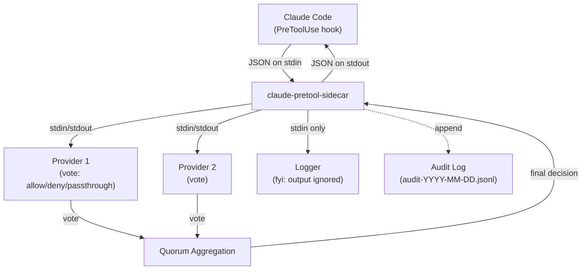

# claude-pretool-sidecar

<!-- Badges: CI, crates.io, license (to be added) -->

**A composable sidecar for Claude Code's PreToolUse hook that aggregates tool-approval votes from multiple external providers.**

## Overview

`claude-pretool-sidecar` sits between Claude Code and your custom decision-making scripts. When Claude Code is about to use a tool (run a shell command, write a file, etc.), it invokes this sidecar as a hook. The sidecar fans out the tool request to multiple external **providers** -- each of which votes to allow, deny, or abstain -- then aggregates those votes using configurable **quorum rules** and returns a single decision back to Claude Code.

This lets you layer multiple policies, security scanners, and audit loggers without modifying Claude Code itself. Each provider is a standalone executable that communicates via JSON over stdio, so you can write providers in any language (bash, Python, Rust, Node, etc.).

The project follows KISS and Unix philosophy: small composable pieces, stdio as the universal interface, and TOML for human-editable configuration. Built in Rust for reliability and minimal overhead.

## Architecture



## Quick Start

```bash
# 1. Build
cargo build --release

# 2. Create a minimal config (logging only, no decisions)
mkdir -p ~/.config/claude-pretool-sidecar
cat > ~/.config/claude-pretool-sidecar/config.toml << 'EOF'
[quorum]
min_allow = 0
default_decision = "passthrough"

[[providers]]
name = "logger"
command = "claude-pretool-logger"
args = ["--output", "/tmp/claude-tool-requests.jsonl"]
mode = "fyi"
EOF

# 3. Install both binaries
cargo install --path .

# 4. Register as a Claude Code hook (add to ~/.claude/settings.json)
```

Add to your `~/.claude/settings.json`:

```json
{
  "hooks": {
    "PreToolUse": [
      {
        "matcher": "*",
        "hooks": [
          {
            "type": "command",
            "command": "claude-pretool-sidecar",
            "timeout": 30
          }
        ]
      }
    ]
  }
}
```

## Installation

### From Source

```bash
git clone https://github.com/shibuido/claude-pretool-sidecar.git
cd claude-pretool-sidecar
cargo build --release
```

Binaries are produced in `target/release/`:

* `claude-pretool-sidecar` -- the main sidecar binary
* `claude-pretool-logger` -- companion FYI logger

Install to your PATH:

```bash
cargo install --path .
```

## Configuration

The sidecar uses a TOML config file. It searches these locations in order (first found wins):

1. `--config <path>` CLI flag
2. `$CLAUDE_PRETOOL_SIDECAR_CONFIG` environment variable
3. `.claude-pretool-sidecar.toml` in the current directory (project-level)
4. `~/.config/claude-pretool-sidecar/config.toml` (XDG user-level)
5. `~/.claude-pretool-sidecar.toml` (home fallback)

### Annotated Example

```toml
# Quorum rules: how votes are aggregated
[quorum]
min_allow = 1              # Minimum "allow" votes required to approve
max_deny = 0               # Maximum "deny" votes tolerated (0 = any deny blocks)
error_policy = "passthrough"  # Treat provider errors as: "passthrough" | "deny" | "allow"
default_decision = "passthrough"  # When quorum not met and no deny threshold exceeded

# Timeouts
[timeout]
provider_default = 5000    # Default per-provider timeout in milliseconds
total = 30000              # Total timeout for all providers combined

# Audit logging
[audit]
enabled = true
output_dir = "/var/log/claude-pretool-sidecar"  # Date-chunked: audit-YYYY-MM-DD.jsonl
max_total_bytes = 10485760   # 10 MB total across all log files
max_file_bytes = 5242880     # 5 MB per individual file

# Provider definitions (each is a separate [[providers]] block)
[[providers]]
name = "security-checker"
command = "/usr/local/bin/my-security-checker"
args = ["--strict"]
mode = "vote"              # "vote" (participates in quorum) or "fyi" (logging only)
timeout = 10000            # Override default timeout for this provider
env = { MY_VAR = "value" } # Additional environment variables

[[providers]]
name = "audit-logger"
command = "claude-pretool-logger"
args = ["--output", "/var/log/claude-tools.jsonl"]
mode = "fyi"               # Output ignored, just receives the payload
```

See the `examples/` directory for ready-to-use configurations:

* `examples/config-logging-only.toml` -- pure logging, no decisions
* `examples/config-single-gatekeeper.toml` -- one provider decides everything
* `examples/config-multi-provider.toml` -- three voters plus a logger

### Environment Variable Overrides

Key settings can be overridden via environment variables (prefix `CPTS_`):

| Variable | Overrides |
|----------|-----------|
| `CPTS_MIN_ALLOW` | `quorum.min_allow` |
| `CPTS_MAX_DENY` | `quorum.max_deny` |
| `CPTS_ERROR_POLICY` | `quorum.error_policy` |
| `CPTS_TIMEOUT` | `timeout.provider_default` |
| `CPTS_MAX_LOG_BYTES` | `audit.max_total_bytes` |

## Quorum Rules

The quorum algorithm determines the final decision from individual provider votes. Deny always takes priority -- this is a security-conscious default.

### Algorithm

```
1. Collect votes from all non-FYI providers (respecting timeouts)
2. Classify: allow_count, deny_count, passthrough_count, error_count
3. Apply error_policy to reclassify errors
4. IF deny_count > max_deny  --> DENY
5. IF allow_count >= min_allow --> ALLOW
6. ELSE --> default_decision
```

### Examples

**Single gatekeeper** (1 provider must allow):

```toml
[quorum]
min_allow = 1
max_deny = 0
```

**Simple majority** (2 of 3 must allow, zero denies):

```toml
[quorum]
min_allow = 2
max_deny = 0
```

**Tolerant setup** (3 of 5 must allow, 1 deny tolerated):

```toml
[quorum]
min_allow = 3
max_deny = 1
```

**Pure logging** (no voting providers, everything passes through):

```toml
[quorum]
min_allow = 0
default_decision = "passthrough"
```

### Edge Cases

* **Zero non-FYI providers**: Returns `default_decision` immediately
* **All providers error**: Depends on `error_policy`; if all convert to passthrough and `min_allow > 0`, returns `default_decision`
* **Provider timeout**: Treated as error, subject to `error_policy`

## Writing Providers

A provider is any executable that reads JSON from stdin and writes JSON to stdout. This makes it trivial to write providers in any language.

### Input (stdin)

The sidecar writes the Claude Code hook payload to the provider's stdin as a single JSON object, then closes stdin:

```json
{
  "tool_name": "Bash",
  "tool_input": {
    "command": "rm -rf /tmp/foo",
    "description": "Delete temporary files"
  },
  "session_id": "abc123",
  "hook_event": "PreToolUse"
}
```

### Output (stdout)

The provider writes a single JSON object:

```json
{
  "decision": "allow"
}
```

Valid `decision` values: `"allow"`, `"deny"`, `"passthrough"`

An optional `reason` field is logged but does not affect the decision:

```json
{
  "decision": "deny",
  "reason": "Command matches dangerous pattern: rm -rf"
}
```

### Error Handling

* **Non-zero exit code**: Treated as error
* **Invalid JSON on stdout**: Treated as error
* **Missing `decision` field**: Treated as error
* **Timeout exceeded**: Process killed, treated as error
* **Empty stdout**: Treated as error

All errors are subject to the `error_policy` quorum setting.

### Example: Minimal Bash Provider

```bash
#!/bin/bash
# Deny any command containing "rm -rf"
INPUT=$(cat)
COMMAND=$(echo "$INPUT" | jq -r '.tool_input.command // empty')

if echo "$COMMAND" | grep -q 'rm -rf'; then
  echo '{"decision": "deny", "reason": "rm -rf is not allowed"}'
else
  echo '{"decision": "allow"}'
fi
```

## Companion Tools

### claude-pretool-logger

A built-in companion binary for logging hook events to a file or stderr. Designed to be used as an FYI provider.

```toml
[[providers]]
name = "logger"
command = "claude-pretool-logger"
args = ["--output", "/var/log/claude-tools.jsonl"]
mode = "fyi"
```

When no `--output` is specified, it logs to stderr. Each log entry is a JSON line with a timestamp envelope wrapping the original hook payload.

## Audit Logging

The sidecar has built-in audit logging separate from FYI providers. It records the full decision lifecycle: which providers were consulted, how each voted, response times, and the final decision.

### Log Format

Logs are written as JSON Lines (one JSON object per line):

```json
{
  "timestamp": "2026-03-22T14:30:00Z",
  "hook_event": "PreToolUse",
  "tool_name": "Bash",
  "tool_input": {"command": "ls -la"},
  "session_id": "sess-123",
  "providers": [
    {"name": "security-checker", "vote": "allow", "response_time_ms": 45},
    {"name": "team-policy", "vote": "allow", "response_time_ms": 120},
    {"name": "audit-logger", "mode": "fyi", "response_time_ms": 12}
  ],
  "final_decision": "allow",
  "total_time_ms": 132
}
```

### Configuration

```toml
[audit]
enabled = true
output_dir = "/var/log/claude-pretool-sidecar"
max_total_bytes = 10485760   # 10 MB total
max_file_bytes = 5242880     # 5 MB per file
```

### Log Rotation

* **Date-based chunking**: Files are named `audit-YYYY-MM-DD.jsonl`
* **Per-file size limit**: When a file exceeds `max_file_bytes`, it is truncated to keep the most recent entries
* **Total size limit**: When the directory exceeds `max_total_bytes`, the oldest files are deleted
* **Truncation sentinel**: A `{"_truncated": true, ...}` line marks where truncation occurred

## Claude Code Integration

### Method 1: Manual Hook Configuration

Add to `.claude/settings.json` (project-level) or `~/.claude/settings.json` (user-level):

```json
{
  "hooks": {
    "PreToolUse": [
      {
        "matcher": "*",
        "hooks": [
          {
            "type": "command",
            "command": "claude-pretool-sidecar",
            "timeout": 30
          }
        ]
      }
    ],
    "PostToolUse": [
      {
        "matcher": "*",
        "hooks": [
          {
            "type": "command",
            "command": "claude-pretool-sidecar --post-tool",
            "timeout": 10
          }
        ]
      }
    ]
  }
}
```

### Hook Output Format

The sidecar returns responses in Claude Code's expected format:

* **Allow**: `{"hookSpecificOutput": {"permissionDecision": "allow"}}`
* **Deny**: `{"hookSpecificOutput": {"permissionDecision": "deny"}, "systemMessage": "..."}`
* **Passthrough**: `{}`

### Exit Codes

* `0` -- Success (stdout parsed as JSON response)
* `2` -- Blocking error (stderr fed back to Claude as error message)
* Other -- Non-blocking error (logged, operation continues)

## QA & Testing

### Unit and Integration Tests

```bash
cargo test
```

The test suite includes 43 tests (37 unit + 6 integration) covering config parsing, quorum logic, hook format compliance, provider execution, and audit logging.

### QA Scripts

The `qa/` directory contains standalone and live test suites:

```bash
# Standalone tests (no Claude Code needed)
qa/scripts/run-all-standalone.sh

# In Docker (isolated, reproducible)
qa/docker/cpts-standalone.sh build
qa/docker/cpts-standalone.sh test
```

Live Claude Code tests require an `ANTHROPIC_API_KEY`:

```bash
export ANTHROPIC_API_KEY="sk-ant-..."
qa/scripts/run-all-live-claude-code.sh

# Or in Docker
qa/docker/cpts-claude-code.sh build
qa/docker/cpts-claude-code.sh test
```

See `qa/README.md` for full details on test suites, Docker management commands, and helper scripts.

## Project Structure

```
claude-pretool-sidecar/
├── src/
│   ├── main.rs              # Entry point: stdin -> providers -> quorum -> stdout
│   ├── hook.rs              # Hook event/response types
│   ├── config.rs            # TOML config parsing
│   ├── quorum.rs            # Vote aggregation algorithm
│   ├── provider.rs          # External process execution
│   ├── audit.rs             # Audit logging with rotation
│   └── bin/
│       └── logger.rs        # Companion FYI logger binary
├── tests/                   # Integration tests
├── examples/                # Example TOML configurations
│   ├── config-logging-only.toml
│   ├── config-single-gatekeeper.toml
│   └── config-multi-provider.toml
├── docs/
│   ├── design/              # Design documents
│   │   ├── architecture.md
│   │   ├── voting-quorum.md
│   │   ├── stdio-protocol.md
│   │   ├── configuration.md
│   │   └── log-rotation.md
│   └── guidelines/          # Development guidelines
├── qa/                      # QA test suites and Docker environments
│   ├── scripts/             # Automated test scripts
│   ├── helpers/             # Test utilities (gen-payload, gen-config, etc.)
│   ├── checklists/          # Manual QA checklists
│   └── docker/              # Dockerfiles and management scripts
├── Cargo.toml
├── AGENTS.md                # Agent/contributor instructions
├── CURRENT_WORK.md          # Current development status
└── FUTURE_WORK.md           # Roadmap and deferred scope
```

## Contributing

* Make small, focused commits with descriptive messages (see `ai_docs/small_descriptive_commits.md`)
* Design decisions go in `docs/design/` as markdown documents
* Tests serve as documentation -- each test demonstrates expected behavior
* Follow the existing patterns in the codebase (KISS, Unix philosophy, stdio interfaces)
* Run `cargo test` and `qa/scripts/run-all-standalone.sh` before submitting changes

## License

MIT -- see `Cargo.toml` for details.
